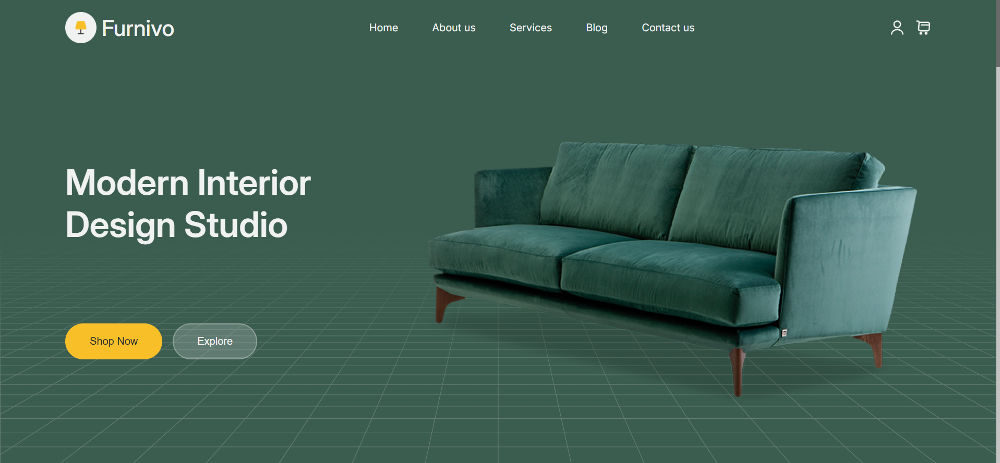

# 🪑 Furni Shop

A modern and responsive furniture e-commerce website built with **HTML5**, **CSS3**, and **JavaScript**. The project features a clean user interface, responsive design, and interactive components to provide a smooth shopping experience.

## 📸 Screenshot

<p align="center">
  
</p>

## 🚀 Live Demo

[Live Demo](https://ehsan-elahi-dev.github.io/furni-shop/)

---

## ✨ Features

- 📱 Fully Responsive Design
- 🎨 Modern & Clean User Interface
- 🪑 Furniture Product Showcase
- 🛒 Interactive Shopping Experience
- ❤️ Wishlist Button
- ⭐ Featured Products Section
- 📂 Product Categories
- 💬 Customer Testimonials
- 📧 Newsletter Subscription
- ⚡ JavaScript Interactions
- 📐 Pixel-Perfect Layout

---

## 🛠️ Built With

- HTML5
- CSS3
- JavaScript

---

## 📂 Project Structure

```text
furni-shop/
│
├── assets/
│   ├── images/
│   ├── icons/
│   └── screenshot/
│       └── screenshot.png
│
├── index.html
├── style.css
├── script.js
└── README.md
```

---

## 📥 Installation

Clone the repository:

```bash
git clone https://github.com/your-username/furni-shop.git
```

Open the project folder and run **index.html** in your browser.

---

## 🎯 Future Improvements

- Shopping Cart
- Product Search
- Product Filtering
- Dark Mode
- Backend Integration
- User Authentication
- Payment Gateway Integration

---

## 👨‍💻 Author

**Ehsan Elahi**

GitHub: https://github.com/ehsanellahi1385-commits

---

## ⭐ Support

If you like this project, don't forget to give it a ⭐ on GitHub!
